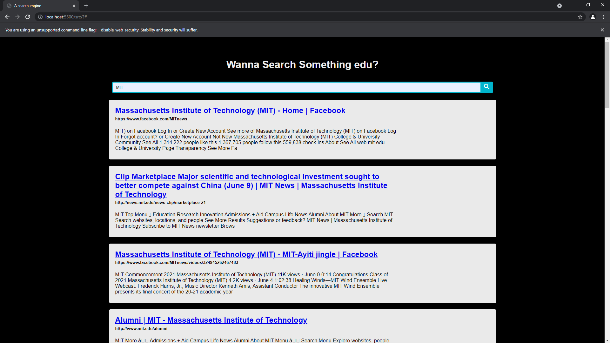
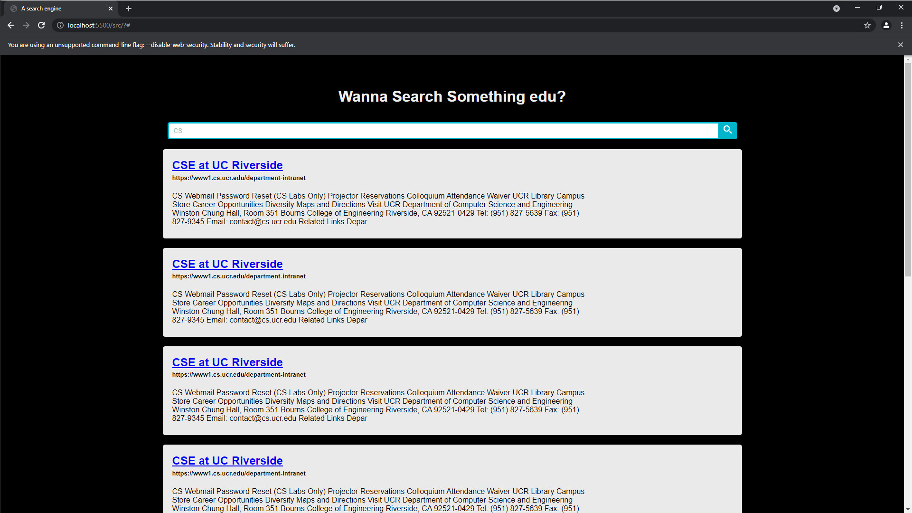

# CS172-Project

## Team member 1 - Biqian Cheng: 
### **Contributions:**

* Finsihing report (README)
* Build websites the major structure and the frontend, including
Implement search bar and search bar button
* Debug website and test its functionalities
## Team member 2 - Shuang Zhou: 
### **Contributions:**
* contributes to elastic search phython script
* connect the query search to backend pasing into Elastic Search and then it is able to display the result 
* Modify the parser that its format is acceptable by Elastic Search
* Upload the clawler page to the Elastic Search database and Index

## Team member 3 - Qi Qi
### **Contributions:**

* Helping with building the crawler
* Arrange discussions and meetings

## Team member 4 - Jim Poon
### **Contributions:**
* Add on to the README report
* Input seeds 
* Set up a basic crawler with major functions 
* Building parser 

# Explanation of our design
The whole project is driven by several parts:

Languages used: Python, CSS JaveScript, HTML
## Part 1
1. Crawler

   a. Crawl the urls given in seeds.txt using "request" and "urllib.parse" library

   b. Detect duplicate pages during crawling (this page will not be counted)

   c. Has a crawl history stored into a text file(history.txt)
2. Parser

   a. Parse the html files that are crawled by the crawler using "BeautifulSoup" library

   b. Using BeautifulSoup to parse body and title text from html files

   c. Return a list consisting current html's body text, title, and urllib
3. Driver

   a. The main function that drives the crawler, parser, and a small file system related to seeds.txt

   b. File system of seeds.txt:
    * The system enables the user to add or subtract seeds from seeds.txt

	* If the user does not enter a '.edu'   seed whlie adding, a warning will be shown

    * All new seeds added into the seeds.txt will automatecally be add a prefix of "https://" if it does not exist

## Part 2
4. Indexer

    When we craw the page, we will get the result from HTML source code. We strip down the invisible element and only store the body text. Then, formatting them into a acceptable format in ElasticSearch. Meanwhile, they are updated into the database.

    The ElasticSearch instance helps us to build index for each HTML page. Elastic seach provides as REST API for us to fetch the result.
## Part 3 - Extension

We decided to build a website that contains a title and a search bar to meet the basid requirments. 

Correpsonding results are show below the search bar. Each URL is clickable and it nevigates users to correct web page.

Our motivation of creating this web page is that we would like to provide more visualizations in terms of the crawler's results.