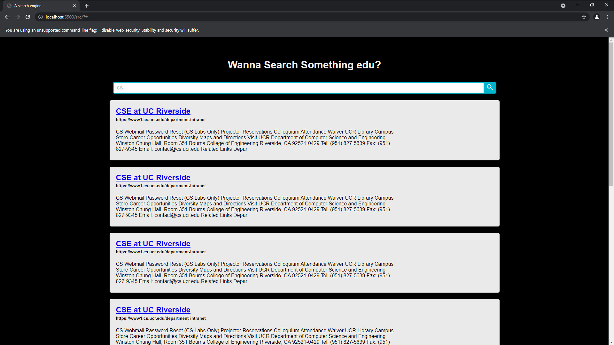
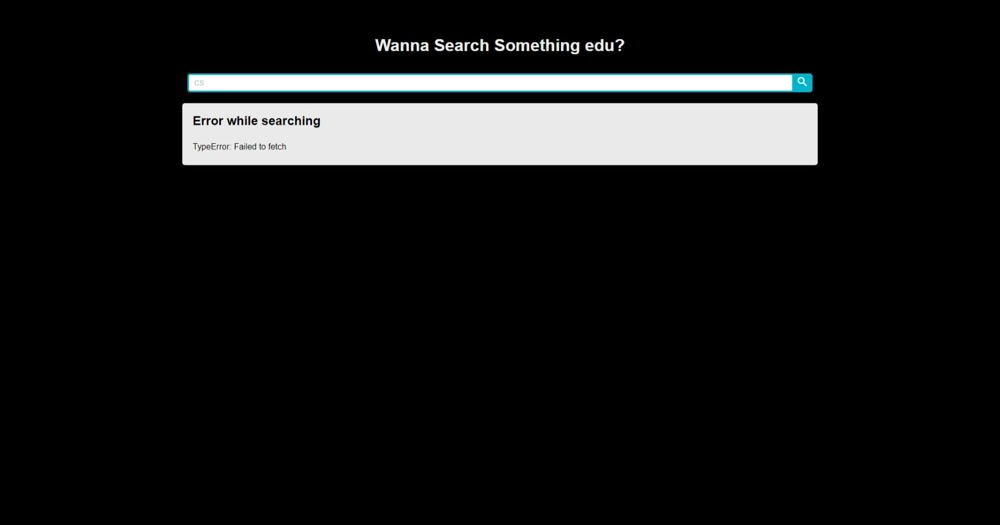
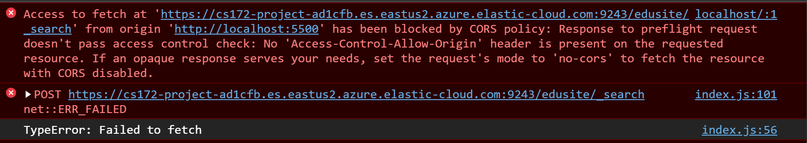

# CS172 Team DEAL

## Team member 1 - Biqian Cheng:

### **Contributions:**

-   Finishing report (README)
-   Build websites the major structure and the frontend, including
    Implement search bar and search bar button
-   Debug website and test its functionalities

## Team member 2 - Shuang Zhou:

### **Contributions:**

-   Contributes to ElasticSearch script
-   Pass in the query search to ElasticSearch and display the result on web
-   Modify the parser to return the format that is acceptable by ElasticSearch
-   Upload the crawled page to the ElasticSearch database and Index

## Team member 3 - Qi Qi

### **Contributions:**

-   Helping with building the crawler
-   Arrange discussions and meetings

## Team member 4 - Jim Poon

### **Contributions:**

-   Add on to the README report
-   Input seeds
-   Construct the crawler with major functionalities.
-   Build CLI Interface scirpt
-   Build parser

# Project design

The whole project is driven by several parts:

Languages used: Python, CSS JavaScript, HTML

## Part 1

1. Crawler

    - Crawl the urls given in seeds.txt using "request" and "urllib.parse" library

    - Detect duplicate pages during crawling (this page will not be counted)

    - Has a crawl history stored into a text file(history.txt)

2. Parser

    - Parse the html files that are crawled by the crawler using "BeautifulSoup" library

    - Using BeautifulSoup to parse body and title text from html files

    - Return a list consisting current html's body text, title, and urllib

3. Driver

    - The main function that drives the crawler, parser, and a small file system related to seeds.txt

    - File system of seeds.txt:

        - The system enables the user to add or subtract seeds from seeds.txt

        - If the user does not enter a '.edu' seed while adding, a warning will be shown

        - All new seeds added into the seeds.txt will automatically be add a prefix of "https://" if it does not exist

## Part 2

-   Indexer

    When we crawl the page, we will get the result from HTML source code. We strip down the invisible element and only store the body text. Then, formatting them into a acceptable format in ElasticSearch. Meanwhile, they are updated into the database.

    The ElasticSearch instance helps us to build index for each HTML page. Elastic search provides as REST API for us to fetch the result.

## Part 3 - Extension

-   Web-Interface

    We decided to build a website that contains a title and a search bar to meet the basic requirements.

    Corresponding results are show below the search bar. Each URL is clickable and it navigates users to correct web page.

    
    

    Our motivation of creating this web page is that we would like to provide more visualizations in terms of the crawler's results.

# Instruction

## Run Crawler

-   ## Installation

    First of all, before running the crawler, there are a few dependencies that is require to run our python script. Make sure the following python dependencies are fulfilled.

    -   Python >= 3.6 ( You can check your python version by typing `python --version` )
    -   BeautifulSoup 4 ( `python -m pip install beautifulsoup4` )
    -   ElasticSearch ( `python -m pip install elasticsearch` )

    Once all the dependencies are installed, you can proceed to the next section.

-   ## Command

    ### `python driver.py`

    Run the driver app. The driver app provide a CLI that prompt the user to add, extract seeds and call the crawler.

## Run Web app

-   ## Command

    ### `./server.sh`

    Run the website on localhost.
    This script basically `cd` to the src directory and execute `python3 -m http.server`.  
    If you cannot execute this script in your shell, please give the script the permission to execute by typing
    `chmod a+rx server.sh`
    This should allow the script to be executed.

-   ## FAQ

    -   ### Why does the web app fail to fetch any results?

        
        This is typically beacause chrome (or the browser you are using) block CORS request by default for security measure.

        If you open up your dev console (Press <kbd>F12</kbd> should bring it up),it should appear something in the console like this
        

        To solve this, you will need to manually disable the security feature for your browser.

        For chrome, here is a simple link that provide you the instruction on how to disable it.

        [Click Here](https://alfilatov.com/posts/run-chrome-without-cors/)

        After you run the disable version, it should be able to perform api calls and give you the result.

    ### **Reminder: DO NOT USE the disabled browser for credential purposes as the security feature is totally disabled.**
